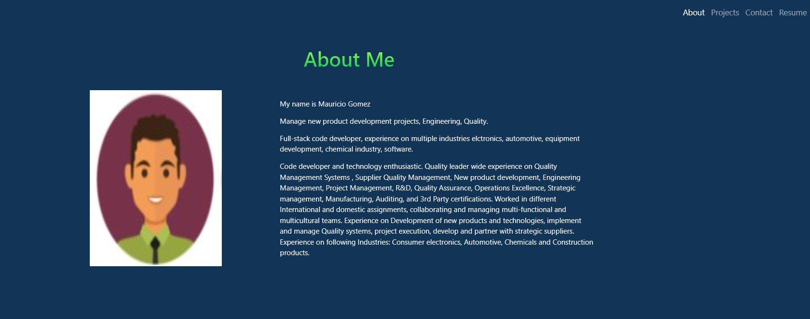
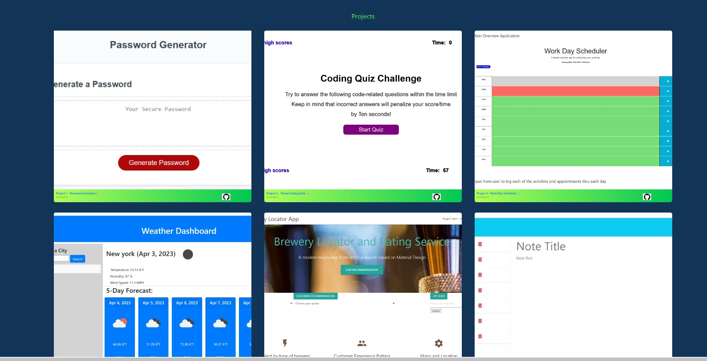
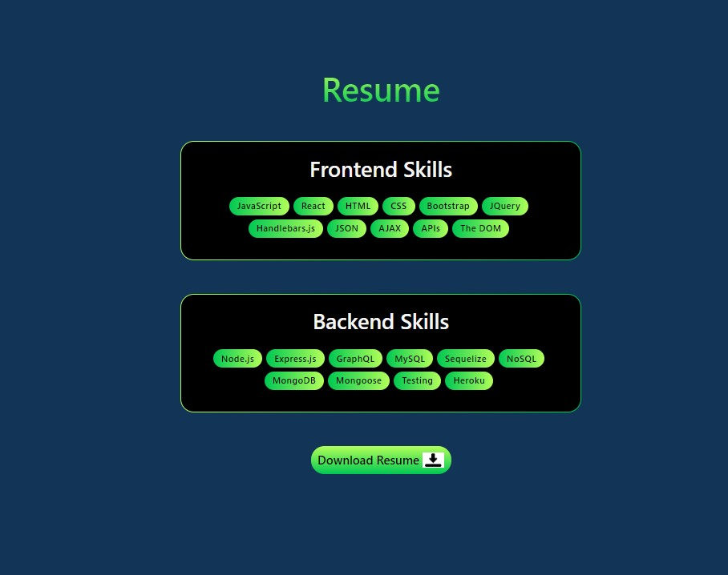

# MAUGB-M20C-React-Portfolio

# React Personal Portfolio

## Description

This is a professional personal portfolio using REACT created to display the skills, projects and applications that have been created through the coding boot camp and are good examples of use of technology for each of them.

Create a single page application using REACT to display my personal portfolio.
Showcase my personal information to potential employers, give access to my personal information and my resume in an easy way.

Use the REACT components in and pass my personal data to the application.

Use REACT technology to move from using only HTML for the single web page applications.
I can have my web page with a navigation section, load my information, have a link to my projects.

Create a React application, render the elements using jsx expressions.
Learned important section of React making more functional the forms, fetch data and hooks.
User multiple forms to interact with the application, using event handlers.

## Table of Contents

- [Installation](#installation)
- [Usage](#usage)
- [Credits](#credits)
- [License](#license)

## Installation
This Program can run using on the local terminal hoist location (local port)  3000 or it can run thru a live browser , application has been deployed to GitHub Pages.

Link to Deployed application in GitHub Pages
 https://mauriciogb1.github.io/MAUGB-M20C-React-Portfolio/

 
This program runs under node.js , REACT
Open application from integrated terminal 
Install modules 
Type npm install  - to install package.json  

then type npm start to run that will build and install the application.

        "predeploy": "npm run build",
        "deploy": "gh-pages -d build",
        "start": "react-scripts start",
        "build": "react-scripts build",

Compiled successfully!
You can now view mauricio-gomez in the browser.
  Open http://localhost:3000/     

To create a production build, use npm run build.
Or Go to Web browser and use the following link:
   https://mauriciogb1.github.io/MAUGB-M20C-React-Portfolio/

## Usage

Run npm install 
Run npm start
Use local port 3001

Or use the application on the deployed link

Render introduction page

Go to navigation page

Move to the navigation section a click on the section that you would like to review

About me information

Projects information, click each of the section to access the project and link to the repository location or deployed application

On the section of comments enter information and submit data, e-mail will be validated.

Download the resume on the section resume click the download button.

## Credits

-	Generate license badge: https://shields.io/ .  
-	 Use of NodeJS   16.16.0
-	 Use of JavaScript
-	Use of React
-	Use of ReactDom
-	Use of CSS
-	Use of bootstrap
-	Use of React Bootstrap
-	GitHub Pages
-	GitHub

## License

This program runs under the MIT license.
    MIT
    
  

## Features

-	Single-page application portfolio for a web developer
-	Portfolio display
-	Navigation section for portfolio About, Projects, Resume, Contact
-	About Me, Portfolio, Contact, and Resume, and the title the current section is highlighted
-	Editor application is on the browser terminal.
-	Introduction section
-	Avatar section and a short bio about them
-	Images of projects and access to deploy them.
-	Section to Download the resume on .pdf format.
-	Section for contact and message
-	Validation of e-mail

## How to Contribute

If you would like to contribute please send an e-mail to gomezb_mauricio@hotmail.com. Please share your GitHub repository name and your message.

## Contact

gomezb_mauricio@hotmail.com

https://github.com/MauricioGB1

